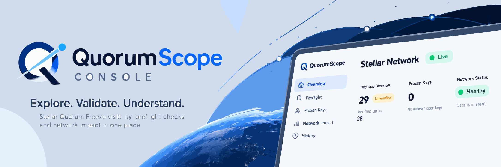

<div align="center">



# QuorumScope Console

QuorumScope web console and TypeScript SDK for Stellar Quorum Freeze visibility, preflight checks, impact review, and freshness monitoring.

[](https://github.com/QuorumScope/quorumscope-console/actions/workflows/ci.yml)
[](https://github.com/QuorumScope/quorumscope-console/actions/workflows/e2e.yml)
[](LICENSE)
[](https://quorumscope-console.vercel.app)
[](tests/openapi.test.mjs)
[](https://quorumscope-console.vercel.app/network)
[](https://github.com/QuorumScope/quorumscope-console/tree/main)

[Documentation](https://quorumscope.github.io/quorumscope-console/) · [Staging Console](https://quorumscope-console.vercel.app) · [Staging API](https://quorumscope-engine-api.onrender.com) · [Latest Release](../../releases/latest) · [Security](SECURITY.md) · [Contributing](CONTRIBUTING.md)

</div>

---

## What is QuorumScope Console?

QuorumScope Console is the web interface and TypeScript SDK workspace for the QuorumScope platform. It connects to the QuorumScope Engine to provide clear visibility into Stellar Quorum Freeze (CAP-77) state, real-time data freshness, transaction preflight evaluations, blast radius impact data, and historical key modifications.

The repository includes:
- **Web Console (`apps/web`)**: A Next.js application designed for operators, developers, and auditors.
- **TypeScript SDK (`packages/sdk`)**: A typed client library wrapping the QuorumScope Engine OpenAPI contract.

## Why it exists

When a ledger key is frozen on Stellar through CAP-77 quorum mechanisms, transactions attempting to modify or access that entry fail validation unless covered by a freeze bypass entry.

Developers and operators need:
- An accessible interface to monitor freeze state, bypass entries, and source ledger freshness.
- Instant feedback on whether candidate transaction envelopes are clear, blocked, or conditionally dependent before submitting them to the network.
- Visual inspection of affected accounts, trustlines, and contracts via an interactive Freeze Map.
- Clear distinction between confirmed empty freeze sets, unverified protocol versions, and stale indexer states.

QuorumScope Console provides this visibility without requiring operators to interact with low-level RPC outputs or SQL tables directly.

## Current staging status

| Service | Host | Status |
| --- | --- | --- |
| Web Console | Vercel | [Staging Console](https://quorumscope-console.vercel.app) |
| Engine API | Render | [Staging API](https://quorumscope-engine-api.onrender.com) |
| Engine Storage | Supabase | Managed PostgreSQL 16 |
| Target Network | Stellar Testnet | RPC at `https://soroban-testnet.stellar.org` |

Staging notes:
- The staging console is deployed on Vercel and configured with `NEXT_PUBLIC_QUORUMSCOPE_API_BASE_URL=https://quorumscope-engine-api.onrender.com`.
- The backing engine on Render runs on a free tier instance that sleeps during idle periods. Initial requests may take 30 to 60 seconds while the backend wakes up.
- Testnet currently contains 0 frozen keys and 0 bypass entries.
- Testnet reports Protocol 29 while the engine verifies up to Protocol 28. The console correctly presents an `unverified_protocol` warning badge across live pages.

## Features

- **Overview Dashboard**: High-level network statistics, active freeze counts, bypass totals, and freshness indicators.
- **Network Status**: Detailed RPC checkpoints, latest network ledgers, ingestion lag metrics, and protocol compatibility warnings.
- **Data Freshness Panel**: Clear status reporting (`Current`, `Indexing Behind`, `Stale`, `Unknown`) with ledger sequence markers.
- **Protocol Compatibility Warning**: Explicit warnings when the connected network runs a protocol newer than the engine's verified maximum.
- **Frozen Keys Directory**: Paginated directory with filtering by key kind (`account`, `trustline`, `contract_data`, `contract_code`) and active status.
- **Key Detail & History**: In-depth inspection showing decoded fields, canonical XDR, and full freeze/unfreeze timeline events.
- **Bypasses Directory**: Paginated tracking of active freeze bypass transaction hashes.
- **Freeze Episodes & Timelines**: Incident tracking showing opened/closed ledgers and sequential cryptographic evidence logs.
- **Preflight Transaction Sandbox**: In-browser candidate transaction evaluation with status badges, finding breakdowns, and clear explanations.
- **Impact & Freeze Map**: Visual lane map grouping affected keys by kind alongside an evidence table with pagination and filters.
- **Developer Examples**: Copy-ready code snippets for SDK integration, cURL queries, and error handling.
- **TypeScript SDK (`@quorumscope/sdk`)**: Fully typed client generated from the engine OpenAPI 3.0 contract.
- **OpenAPI Drift Verification**: Automated check ensuring TypeScript types match the engine API specification.
- **Strict Privacy Controls**: Transaction XDR is sent directly from the browser to the engine; it never touches console server logs, storage, or external third parties.

## Architecture

```
+--------------------------------------------------------------------+
|                         Client Browser                             |
|                                                                    |
|  +---------------------------+       +--------------------------+  |
|  |     Next.js Web UI        |       |    TypeScript SDK        |  |
|  |  (React Server & Client)  |       |   (@quorumscope/sdk)     |  |
|  +-------------+-------------+       +------------+-------------+  |
+----------------|----------------------------------|----------------+
                 |                                  |
                 | SSR Page Requests                | Direct Preflight POST
                 v                                  v
+-------------------------------+      +-----------------------------+
|    Console Server (Vercel)    |      |    QuorumScope Engine API   |
|    - HTML Rendering           | ---> |    (Render / Axum Server)   |
|    - CSP Header Enforcement   | Read |    - /api/v1/preflight      |
|    - No XDR Logging           | Only |    - /api/v1/network        |
+-------------------------------+      +-----------------------------+
```

Key architectural decisions:
1. **Direct Preflight Submission**: Transaction XDR pasted into the preflight tool is posted directly from the user browser to the engine API. The console server never receives, forwards, or logs transaction envelopes.
2. **Build-Time Engine Configuration**: The engine endpoint is inlined during build time via `NEXT_PUBLIC_QUORUMSCOPE_API_BASE_URL`.
3. **Content Security Policy**: Strict CSP headers restrict `connect-src` to `'self'` and the explicitly configured engine origin.
4. **Typed Contract Alignment**: The SDK relies on types generated directly from `packages/sdk/openapi/quorumscope-engine-v1.json`.

## Quick start

### Prerequisites

- Node.js `>=24.21.0 <25`
- Corepack enabled with pnpm `12.9.1`

### Local setup

1. Clone the repository and install dependencies:

```bash
git clone https://github.com/QuorumScope/quorumscope-console.git
cd quorumscope-console
corepack pnpm install --frozen-lockfile
```

2. Configure environment variables:

```bash
cp .env.example apps/web/.env.local
```

Set the engine API URL in `apps/web/.env.local`:

```env
NEXT_PUBLIC_QUORUMSCOPE_API_BASE_URL=http://127.0.0.1:8080
```

3. Run the development server:

```bash
pnpm dev
```

Open [http://localhost:3000](http://localhost:3000) in your browser.

4. Build for production:

```bash
pnpm build
```

## SDK usage

Install the workspace package or import `@quorumscope/sdk` directly:

```typescript
import { QuorumScopeClient, QuorumScopeApiError } from '@quorumscope/sdk';

// Initialize the client
const client = new QuorumScopeClient({
  baseUrl: 'https://quorumscope-engine-api.onrender.com',
});

// Query network state and data freshness
const network = await client.network.get();
console.log('Network:', network.name);
console.log('Freshness:', network.freshness.status);
console.log('Source ledger:', network.freshness.source_ledger);

// Query engine status
const status = await client.status.get();
console.log('Lag ledgers:', status.freshness.ingestion_lag_ledgers);

// Run candidate transaction preflight analysis
try {
  const result = await client.preflight.analyze({
    transactionXdr: 'AAAAAgAAAA...',
  });

  console.log('Status:', result.status);
  console.log('Findings:', result.findings);
} catch (error) {
  if (error instanceof QuorumScopeApiError) {
    console.error(`Request ID: ${error.requestId}`);
    console.error(`Error Code: ${error.code} (${error.status}): ${error.message}`);
  } else {
    console.error('Unexpected error:', error);
  }
}
```

## Testing

The console enforces quality through automated testing scripts:

```bash
# Check markdown prose rules and run ESLint
pnpm lint

# Verify OpenAPI sync, run type checks across SDK and web app
pnpm typecheck

# Run unit tests across SDK and web app
pnpm test

# Build SDK and compile production Next.js output
pnpm build

# Verify SDK types match the engine OpenAPI snapshot
pnpm openapi:check

# Run Playwright end-to-end browser and accessibility tests
pnpm e2e

# Run live integration check against local engine instance
pnpm live:check
```

## Deployment

### Vercel Deployment

1. Connect the repository to Vercel.
2. Set the build environment variable:
   - `NEXT_PUBLIC_QUORUMSCOPE_API_BASE_URL`: URL of the deployed engine (e.g. `https://quorumscope-engine-api.onrender.com`).
3. Deploy the application.

### Deployment Checklist

- [ ] Confirm `NEXT_PUBLIC_QUORUMSCOPE_API_BASE_URL` is set to the correct engine URL.
- [ ] Ensure the engine `ALLOWED_ORIGINS` setting includes the deployed console domain.
- [ ] Confirm Content Security Policy headers allow connections only to `'self'` and the engine URL.
- [ ] Verify that transaction XDR remains client-side and is never sent to the console server.
- [ ] Check that `robots.txt` is appropriately configured for the target environment.

## Accessibility and quality

Accessibility and design standards are verified across all routes:
- **Lighthouse Scores (Local Production Build)**:
  - Accessibility: 100 on all tested pages.
  - Best Practices: 100 on all tested pages.
  - Desktop Performance: 89 to 97.
  - Mobile Performance: 67 to 76 (constrained by client bundle hydration under simulated 4x CPU slowdown).
- **Automated axe Testing**: Full automated axe-core runs in Playwright cover light and dark themes on overview, network, keys, detail, preflight, impact, episodes, and status pages.
- **Color Contrast**: Custom tests verify that design tokens meet WCAG 2.1 AA thresholds (4.5:1 for body text, 3:1 for interactive borders and focus rings) across both themes.
- **Keyboard Navigation**: Scripted tests verify that every interactive element (navigation links, skip link, theme toggles, filters, preflight controls, and Freeze Map keys) is operable using the keyboard.
- **Assistive Technology Notice**: Automated axe and scripted keyboard tests confirm structural reachability. However, no manual testing with screen reader software was performed.

## Limitations

- **No Live Non-Empty Freeze Set**: Stellar Testnet currently holds 0 frozen keys. Non-empty freeze states, key histories, and impact data are verified via fixtures.
- **No Deployed Lighthouse Rerun**: Lighthouse numbers on staging were affected by machine load and Render free tier wakeups; staging performance is unmeasured under idle conditions.
- **Render Free Tier Cold Starts**: When the backing engine sleeps, initial page loads may wait up to 60 seconds before receiving data.
- **Screen Reader Review**: No manual screen reader review (e.g. NVDA, VoiceOver) was executed.
- **DOM Renderer Component Tests**: React components are tested via Playwright browser runs and node unit tests rather than jsdom component renderers.
- **Pagination Model**: The console uses page-number pagination because the engine API does not provide cursor-based pagination.
- **Visual Regression Baselines**: Automated pixel-level visual regression baselines are not implemented.

## Security and privacy

- **Transaction XDR Privacy**: Transaction envelopes entered in the preflight tool are posted directly to the engine API. They are never transmitted to the console server, written to server logs, or stored in cookies, localStorage, or sessionStorage.
- **Restricted Storage**: The only value persisted in browser localStorage is the active UI color theme (`light`, `dark`, or `system`).
- **Strict Content Security Policy**: CSP directives restrict network requests exclusively to `'self'` and the configured engine origin.
- **No Third-Party Analytics**: The console includes no third-party trackers, analytics scripts, or telemetry beacons.

For security policies and vulnerability reporting, see [SECURITY.md](SECURITY.md).

## Contributing

We welcome contributions to QuorumScope Console. Please read [CONTRIBUTING.md](CONTRIBUTING.md) for full instructions on setup, coding standards, and testing requirements.

Core contribution policies:
- Run all checks locally (`pnpm lint`, `pnpm typecheck`, `pnpm test`, `pnpm build`) before opening a pull request.
- Keep one logical change per commit.
- Never use `git add .` to stage files.
- Follow Conventional Commits format.

## Roadmap

- Deployed Lighthouse benchmark rerun on an idle dedicated machine.
- Manual screen reader review and assistive usability audit.
- Protocol 29 interface enhancements once the engine verifies Protocol 29.
- Visual regression baseline testing suite.
- Copy-to-clipboard buttons for hashes, addresses, and XDR strings.
- Formal npm registry publication for `@quorumscope/sdk`.
